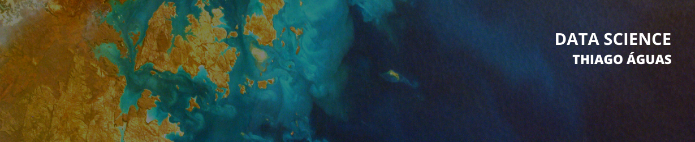

  

# Thiago Águas  
Analista de Geoprocessamento | Data Science

Todos os meus dias são resumidos em dados. Como analista, minha principal característica é criar soluções criativas para cada necessidade de trabalho. Sou apaixonado por aprender e ensinar novas tecnologias aplicáveis no dia a dia. Como cientista de dados, busco soluções reais para problemas reais. Possuo formação em Geografia pela UEM – Universidade Estadual de Maringá e doutorado em Agronomia (Ciência do Solo) pela UNESP – Universidade Estadual Paulista, ambos com background em Geotecnologias, Sensoriamento Remoto, Análise de Dados e Python.

Seja bem vindo ao meu portfolio!

## **Links:**
* [LinkedIn](https://www.linkedin.com/in/thiago-aguas/)
* [Instagram](https://www.instagram.com/thiago.aguas/)
* [Medium](https://www.medium.com/@thdeandrade)

## **Projetos:**

* **[Análise dos dados do Airbnb - Málaga/ES](https://bit.ly/3t82pLq)**
* **[Analisando a Violência no Rio de Janeiro](https://bit.ly/3iqmEzU)**
* **[Avaliação da covid-19 no Brasil e no Mundo](https://bit.ly/3iOgxGF)**
* **[Detecção de Fraude em Cartões de Crédito](https://bit.ly/3C4Rola)**
---
